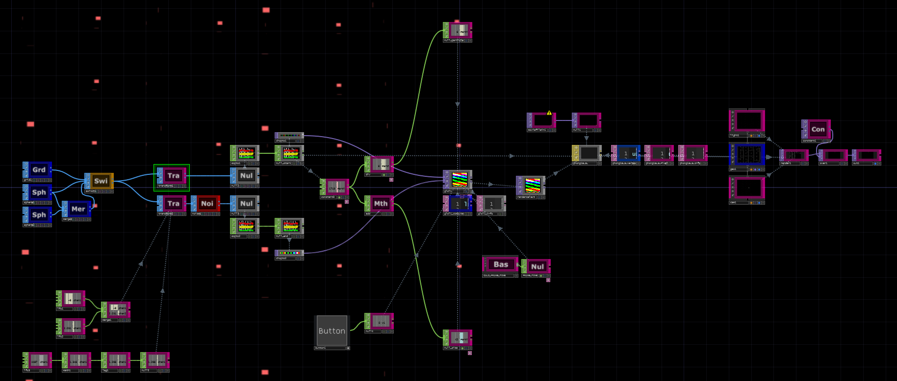
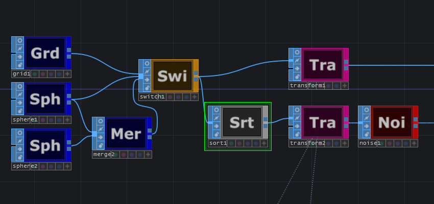
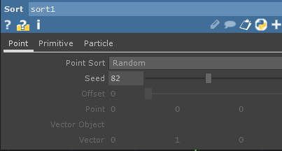
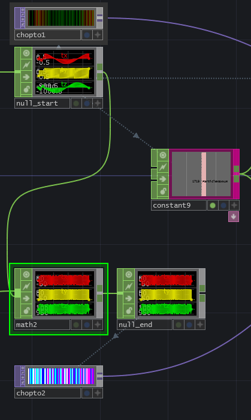
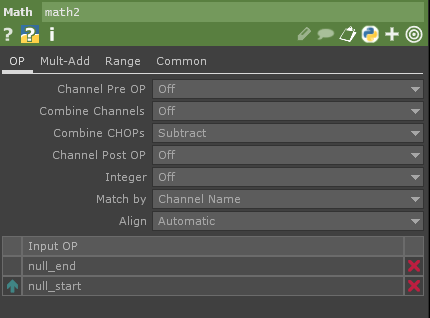

# TouchDesignerのGLSL TOPを使ってみよう！

よくどうやってるのですか？って聞かれることが増えてきたのですが、実はあまりたいしたことはしていなくて申し訳ないです、先輩TD使いの方がすでに詳細な解説を書かれているのに私が何を書くのかは非常に悩みました。
今回はいろんな装飾を外してとにかくシンプルにして最初の取っつきをよくするをメインにしています、ただし自分で色々書き換えたり追加して遊べるようには意識しているので最初のきっかけになればと思います。

## 確認した動作環境

TouchDesigner 099 2018.26750 64Bit Windows 10、Macで動くかはわかりません。

## 実は無理にGLSL TOP使わなくても大丈夫

TouchDesignerはGeometryのInstanceで大体のことはできます、GLSL TOPを無理に使う必要はありません、今回の内容もこれだけではそんなに必要性があるとは思えません、コードを書き換えたりすると色々とできるようになりますが、無理に使う必要もありませんので気楽に見ていただければと思います。

今回作ったものは、SOPのポイントから別のSOPのポイントをターゲットにして移動する、シンプルなものにしていますのでTouchDesignerちょっとできる人も何となく理解できるかも？

## 簡単に概要を説明

下記の画像はノード全体です、多いように見えますが今回説明するノードはそんなにありません。
去年のカレンダーでかなり詳細に説明していただいているGLSLやインスタンスなので細かい部分は説明しません。

左側の青いのがSOPで、中央左寄りの部分がSOPをCHOPにしてTOPにしている部分です、中央あたりになるのが GLSLTOPでポイントの移動計算のシェーダがそこに書かれています、中央より右にあるマテリアルGLSLでGLSLTOPの結果を見た目に反映させています。中央左下にあるボタンを押すと計算結果がリセットされます、また左側にあるオレンジ色に塗られている switch sopの select inputを変えることでポイントの配置などを切り替えて遊べます。 




### 具体的に説明していくと心が折れそうになる部分はすっ飛ばします

GLSLそのものの説明をしていくのは、個別に本を買って勉強していただいた方が良いです。Unity関連のシェーダ本で技術書典などで売られているものなどが分かりやすくて参考になると思います。そのままでは持ってこられない部分も多々ありますが概念とか基本的には同じなので読んでおくと勉強になります。ただ理解とかを追い求めすぎて時間を使ってしまい結局パーティクルは出せるけど目的は何だったのかを忘れないようにしたいですね。

## では実際の作りについて

コンピュートシェーダが好きなので、コンピュートシェーダ（このカタカタかわいい）で書いてます。

ノード全体の中央にあるGLSLTOP(glsl1>glsl1_compute)は、２つのTOPを入力して１つの座標を書き出しています。

#### 開始地点となるSOPのポイント(頂点)→目標地点となるSOPのポイント(頂点)

####  = インスタンスを表示する座標

インスタンを表示する座標を使って GLSL MAT(phong1GLSL) で実際にインスタンスの座標を変えています。
phong1GLSLVertexにその処理が書かれています。

### GLSLコードの中身の説明です(下記にコードは貼っておきます)

```GLSL
layout (local_size_x = 8, local_size_y = 8) in;

uniform int uReset;
uniform vec2 uTimers;

ivec2 textureIndex(int index, float dataResZ)
{
	return ivec2(index % int(dataResZ), floor(index / (float)dataResZ));
}
void main()
{
	int index = int(gl_GlobalInvocationID.x + gl_GlobalInvocationID.y * gl_NumWorkGroups.x * gl_WorkGroupSize.x);

	ivec2 texIndexOut0 = textureIndex(index, uTDOutputInfo.res.z);

	vec4 pos = imageLoad(sTDComputeOutputs[0], texIndexOut0);
	if( uReset == 1 ) {
		pos.xyzw = texelFetch(sTD2DInputs[0], ivec2(index,0), 0).xyzw;
	} 
	vec4 targetPos = texelFetch(sTD2DInputs[1], ivec2(index,0), 0);

	pos.x += (targetPos.x - pos.x)/128.0;
	pos.y += (targetPos.y - pos.y)/64.0;
	pos.z += (targetPos.z - pos.z)/256.0;

	imageStore(sTDComputeOutputs[0], texIndexOut0, pos);
}

```


### 行毎に説明

```
layout(local_size_x, local_size_y = 8 ) in; 
```

一行目にあるから気になりますがそのまま書いておけば問題ないです、GLSLの処理速度が必要になった人は並列かを厳密にしていった方が良いですので、参考にURLを貼っておきますが理解できない場合は無理に読む必要はありません＞https://www.khronos.org/opengl/wiki/Compute_Shader

```
uniform int uReset; 
```

 外部からボタンが押されたときに処理を分岐させるためのもの 0 で何もしない 1で処理分岐

```
uniform vec2 uTimers; 
```

外部からタイマーを受け取るGLSLTOPを動かすためにも使っている、GLSL上では実際には使用していません。

```
ivec2 textureIndex(int index, float dataResZ)
{
	return ivec2(index % int(dataResZ), floor(index / (float)dataResZ));
}
```

画像の横幅を超えたら次の列に移動するための計算をしてくれる関数、ユニークな番号を指定数値の余りを整数のｘとして、yを指定数値で割った数の整数として返す。

```
int index = int(gl_GlobalInvocationID.x + gl_GlobalInvocationID.y * gl_NumWorkGroups.x * gl_WorkGroupSize.x);
```

indexには処理されているときの識別用のユニークな番号が入るようになっています、ここに関してはこのまま使えば良いです。理解したい方は先ほどのURLに詳しく書いてありますのでそちらを見て下さい。GLSLはGPUで処理されているためGLSL TOPのDispatch Sizeやlayoutのlocal_size_xなどの設定によって同列で動作する数などが変化するので順番に処理されるわけでは無いのですが、データなどの管理上番号が欲しい場合がある為です。並列で動く物はあまり相互に作用しない作りが楽だと思います。(意識して作るとコリジョン判定とかもできますが、いろんな良さも失われてしまいがちです)

```
ivec2 texIndexOut0 = textureIndex(index, uTDOutputInfo.res.z);
```

関数から先ほど割り当てたユニークな番号と書き出す先の画像の横幅を使ってどの場所を使うのか決めています。

3x4のサイズの画像に index が 5 の場合は、 5%3=2 3/5= floor(0.6) = 1なので 下記の表の画像の場所を選びます。

|      |      |       |
| :--: | :--: | :---: |
|  9   |  10  |  11   |
|  6   |  7   |   8   |
|  3   |  4   | **5** |
|  0   |  1   |   2   |

```
vec4 pos = imageLoad(sTDComputeOutputs[0], texIndexOut0);
```

インスタンスの表示座標として書き出す画像の前回の計算結果を取り出す

	if( uReset == 1 ) {
		pos.xyzw = texelFetch(sTD2DInputs[0], ivec2(index,0), 0).xyzw;
	} 
外からリセットが押された場合に、座標を初期位置（SOP開始ポイント）に書き換えます

```
vec4 targetPos = texelFetch(sTD2DInputs[1], ivec2(index,0), 0);
```

目標となる座標を二番目に入力されている画像から取得します。
ちなみにですが、全く同じ位置に開始と目標のポイントがある必要は無いのでSOPのソートなどを使ってランダムなんかにすると楽しい。

	pos.x += (targetPos.x - pos.x)/128.0;
	pos.y += (targetPos.y - pos.y)/64.0;
	pos.z += (targetPos.z - pos.z)/256.0;
凄く簡単な計算で申し訳ないですが、結構これだけで綺麗に動く説明は下記へ
XYZで計算を変える必要はありませんが、小技に気がついて欲しいのでわざと分けています。

```
今回は説明するのも恥ずかしい下の式で計算しています、割り算の数は大きくすれば遅くなります。
今の座標 += (目標の座標 - 今の座標) / 128.0
```

```
imageStore(sTDComputeOutputs[0], texIndexOut0, pos);
```

最後にインスタンスに使う座標を上記の表と同じ位置に書き出します。


# 少し改造や変更をして遊びましょう

## バラバラの最終ターゲットを目指す


下記のように switch1 と transform2 の間に sort を入れてみて下さい。





画像の場所に SOPのSortノードを追加します、ポイントをランダムにソートすることでターゲットとなる場所をランダムに変更します、こうするだけでバラバラに移動してくれるようになります。Seed の数値を変更してみてください、パーティクルがいろんな方向に移動します。

## ターゲットで止まらずに無視して移動するようにする

あまり使い道はありませんが、比較的簡単に可能ですので紹介です、よくある中心から広がって外にずっといどうするような絵が作れます。

やることは2つ

1. **事前に目標と開始位置で計算をしておく**
2. **GLSLのプログラムを少し書き換える**

1．**事前に目標と開始位置で計算をしておく**
ターゲットの目標位置から最初の座標を引き算して方向を計算します。
後のプログラムで計算結果のままだと距離まで含めているので normalize して 1.0 にします。 1.0にすると1ずつすすんでほしいなら1をかけ算すれば良いので楽です、5進めたいなら5をかけ算すれば良いですよね。




null_end CHOP の 前に math chop ノードを追加して Combine CHOPs を Subtract (引き算)にしてnull_start をつなぎます、変更しなくても問題ないのですが Match by を Channel Name にしておくことで CHOP の順番が変わった場合でも安心できます。



2．**GLSLのプログラムを少し書き換える**

```
layout (local_size_x = 8, local_size_y = 8) in;

uniform int uReset;
uniform vec2 uTimers;

ivec2 textureIndex(int index, float dataResZ)
{
	return ivec2(index % int(dataResZ), floor(index / (float)dataResZ));
}
void main()
{
	int index = int(gl_GlobalInvocationID.x + gl_GlobalInvocationID.y * gl_NumWorkGroups.x * gl_WorkGroupSize.x);

	ivec2 texIndexOut0 = textureIndex(index, uTDOutputInfo.res.z);

	vec4 pos = imageLoad(sTDComputeOutputs[0], texIndexOut0);
	if( uReset == 1 ) {
		pos.xyzw = texelFetch(sTD2DInputs[0], ivec2(index,0), 0).xyzw;
	} 
	vec4 targetPos = texelFetch(sTD2DInputs[1], ivec2(index,0), 0);

	// 変更/追加
	pos.xyz += normalize(targetPos.xyz) * 2.0; 

	imageStore(sTDComputeOutputs[0], texIndexOut0, pos);
}
```

```
pos.xyz += normalize(targetPos.xyz) * 2.0; 
```

上記の式の部分が変更されました、 targetPos　を normalize して、2ずつ進むようにしています。
進む方向の計算はすでにCHOPで行っているのでこのようになります。

リセットボタンを押すたびに開始位置から目標位置方向へずっと移動するようになります。
これに生存時間などの制限を入れるとよくあるパーティクルの小さな原型になります。

また開始のSOPの transform1 ノードの scale などを大きくすると外から中心に向かうようなものになります。